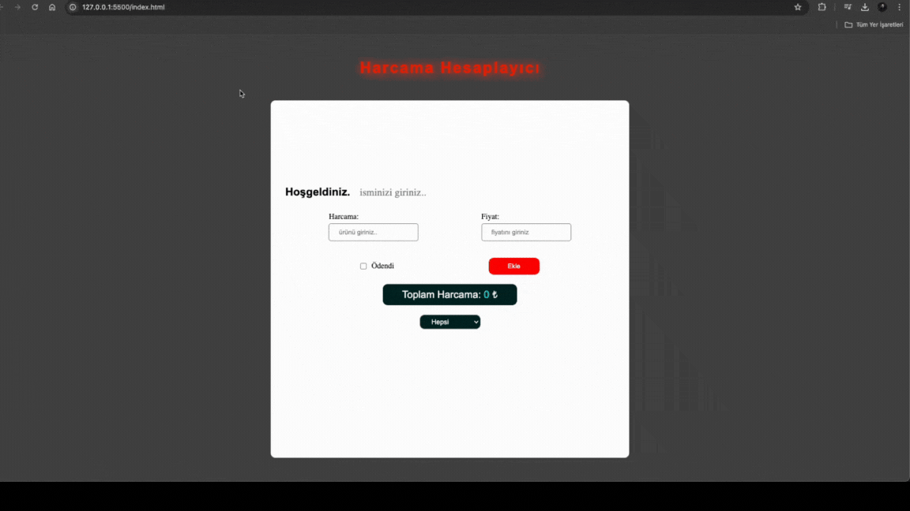

# Expense Calculator

- This is a dynamic expense calculator developed using HTML5, CSS, and JavaScript.

- After the form is filled out, the expense details are listed below. When the "Paid" option is selected, the text appears in green with a strikethrough. If the "Unpaid" option is chosen, the text appears in red. The delete action can be performed by clicking the button on the far right. The total expense is automatically updated by summing the prices in the fields.

## GIF

